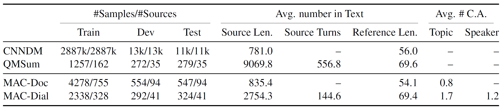
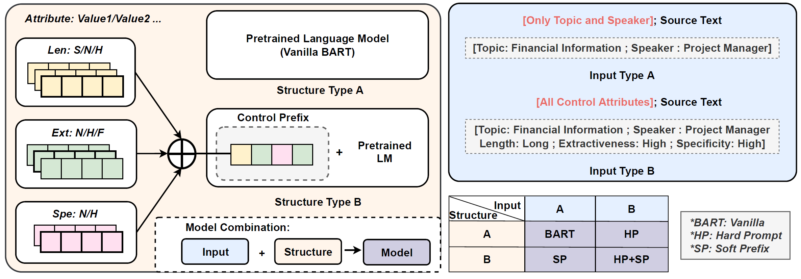
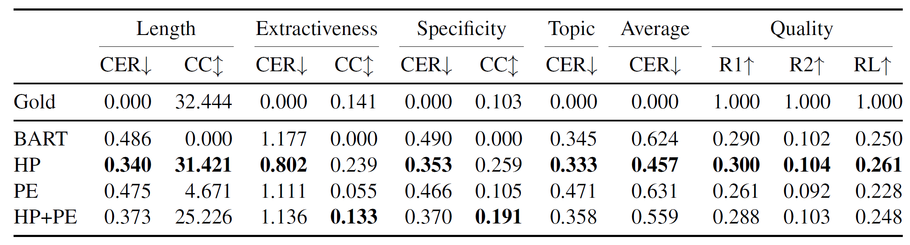
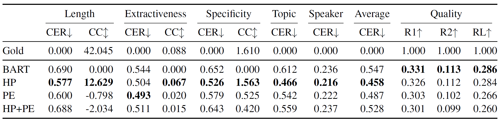

## MACSum
This repository maintains dataset, metrics, and models for paper MACSUM: Controllable Summarization with Mixed Attributes.


## Overview
MACSum is the first human-annotated summarization dataset for controlling mixed attributes. It contains source texts from two domains, news articles and dialogues, with human-annotated summaries controlled by five designed attributes (Length, Extractiveness, Specificity, Topic, and Speaker).

Here is an example of MACSum. For the same input source text, the system needs to generate different reference summaries (green boxes) for different mixed control attributes (orange boxes).

<div  align="center">    

</div>


## Dataset

### Statistics
Statistics of MACSum consist of two parts: MAC-Doc from CNNDM and MAC-Dial from QMSum. Source Len., Ref. Len. are tokens in source and reference. Topic, Speaker are averaged number of topics/speakers.

<div  align="center">    

</div>

### Json Files
One can access the train/valid/test set of MACSum via `dataset` folder which includes `macidal` for dialogue domain and `macdoc` for document domain.
The format of one instance in json data is as follows:
```
{
    "metadata": {          // source text information, one can use metadata to locate the original text
      "dataset": "cnndm",  // origin dataset of source text
      "split": "test",     // split of origin dataset
      "file_id": 339       // id of this split
    },
    "source": [ ... ]      // source text split by sentences/turns in macdoc/macdial dataset
    "references": [        // multiple samples containing the same source with different control_attributes       
      {
        "control_attribute": {       // the same as control attributes in paper
          "length": "short",
          "extractiveness": "normal",
          "specificity": "normal",
          "topic": "",
          "Speaker": ""             // only macdial has this field
        },
        "summary": "The 2014 Khumbu Icefall on Everest caused 16 Nepali deaths last year, resulting in at the end of the Nepal season. Mountaineers return to Everest after the deadly 2014 season. To avoid the deadly area, changes were made to the routes. Climbing permits have increased this year.",
        "title": "Nepal Opens Mount Everest Side After 2014 Tragedy",  // title of the summary
        "relevant_turns": [   // two formats: 1) [start, end] (inclusive), or 2) a single number for that turn 
          [
            0,
            49
          ],
          55
        ]
      }, 
      ...
    ]
}
```

## Metrics
We propose two automatic metrics for evaluating the degree of control of generated summary: Control Error Rate (CER) & Control Correlation (CC)

One can find the implementation in `metric` folder:
- `control_correlation_dial/doc.py` computes the CC
- `control_error_rate_dial/doc.py` computes the CER
- `{attr}_only.py` compute the control attribute metric for single {attr}, corresponding to the $f_r$ in the paper.

## Model and Experiments
### Model Overview
The figure below compares different frameworks. For the HP model, the control attributes are prepended to the input to form a hard prompt. For the SP model, the selected prefixes are added together to form a control prefix. HP+SP contains both hard prompts and control prefixes.


### Setting Environment

1. Install the following packages:
```shell
pip install torch==1.8.1+cu111 -f https://download.pytorch.org/whl/torch_stable.html
pip install datasets transformers==4.9.2  wandb  nltk sentencepiece
pip install huggingface-hub==0.4.0 # ignore the error
```

2. Set ROUGE package

- Create a file ~/.pyrouge/settings.ini
- Write the absolute path of the ROUGE155 to this file, e.g.
```
[pyrouge settings]
home_dir=PATH_TO_FOLDER/ThirdParty/ROUGE/ROUGE-1.5.5/
```

### Run the Model

```
cd model
bash scripts/prefixTuning/run_BART_prefix_{DATASET}.sh
```

One can switch the model type by changing `config_type` in the shell file.

### Model Structure
```angular2html
.
├── configure                              # Config files for experiments, tasks, and settings
│   └── PREFIX_TUNING                      # Config files for hard prompt and soft prefixes
│           ├── BART_...async.cfg          # Experiment setting for HP + SP model in paper
│           ├── BART_...async_concat.cfg   # Experiment setting for HP + SP model in paper, but use concatenation for prefixes.
│           ├── BART_...freeze.cfg         # Experiment setting for SP model in paper
│           ├── BART_...prompt.cfg         # Experiment setting for HP model in paper
│           ├── BART_...scratch.cfg        # Experiment setting for HP model in paper, but init with BART-large
│           └── BART_...vanilla.cfg        # Experiment setting for BART model in paper
│
├── MACSum                                 # Preprocessed dataset used as model input
│   ├── macdoc_flatten                     # Flattened MAC-Doc with json format, a list of samples, each sample is a dictionary
│   └── macdial_flatten                    # Flattened MAC-Doc with json format, a list of samples, each sample is a dictionary
├── metrics                                # Code for evaluation
│   ├── exact_str_match                    # Return a bin denoting if two input strings are exact the same
│   ├── macsum                             # Average of 5 x Control Error Rate and 1 - Averaged ROUGE-1+2+L 
│   └── rouge                              # Averaged ROUGE-1+2+L
├── models                                 # Code for models
│   ├── prompt                             # Code for T5 and BART with prefix-tuning (based on HuggingFace Transformers)
│   └── unified
│           ├── finetune.py                # Code for finetuning
│           └── prefixtuning.py            # Code for prefix-tuning
│
├── seq2seq_construction                   # Code for converting raw data into sequences
│    └──  ...                              # Please check the README in this directory.
│
├── tasks                                  # Code for loading raw data
│    └──  ...                              # Please check the README in this directory.
│
├── third_party                            # Packages from third parties
│    ├── rouge                             # Differ from the one in metric/rouge, this is faster but more informal
│    └── speciteller                       # This is for a deprecated function of spe scores, more in metrics/MACSum/Spe
│
├── utils                                  # Code for some (probably) useful stuff
│       ├── configure.py                   # Code for parsing config files in ./configure
│       ├── dataset.py                     # Code for converting input and output sequences into Datasets for training
│       ├── make_checkpoint.py             # Code for combining trained prompt model to train async models
│       ├── tool.py                        # Code for loading models, seq2seq constructors, and evaluators
│       ├── trainer.py                     # Code for EvaluationFriendlyTrainer. If you want make training-specific modifications, you may want to change something here.
│       └── training_arguments.py          # Code for seq2seq training arguments
│ 
├── requirements.txt                       # Pip environment config file (preferred using commands in this readme)
└── train.py                               # Entry code, which controls train, eval, test, storage, and logging
```
### Experiment Results
Results on MAC-Doc. The performance of the model is better when Control Error Rate (CER) is lower ↓, ROUGE is higher ↑, and Control Correlation (CC) is closer to the golden summary ↕.

<div  align="center">    

</div>

Results on MAC-Dial. The performance of the model is better when Control Error Rate (CER) is lower ↓, ROUGE is higher ↑, and Control Correlation (CC) is closer to the golden summary ↕.


<div  align="center">    

</div>

### Add a New Task
(READMEs in `./tasks`, `./seq2seq_construction`, `./configure` can also be helpful)

- Add a "Loader" of raw data under `./tasks`. You can search HuggingFace Datasets for possibly useful scripts. If not, you can be a contributor to both this project and the HuggingFace community.
- Add a "Sequence Wrapper" under `./seq2seq_construction` to construct sequence inputs (user request and structured knowledge) and sequence outputs from raw data for the unification.
- Add an "Evaluator" for your task under `./metrics`. If a third-party repository is used, remember to add it to `.gitmodules`.
- (optional) You can add a new "Model" under `./models` for a new model architecture or a new learning algorithm.
- Add a config file for your task under `./configure/{YOUT_TASK}`.
- Add a config file for each of your experiments under `./configure/{YOUR_TASK}`.


## Citation
